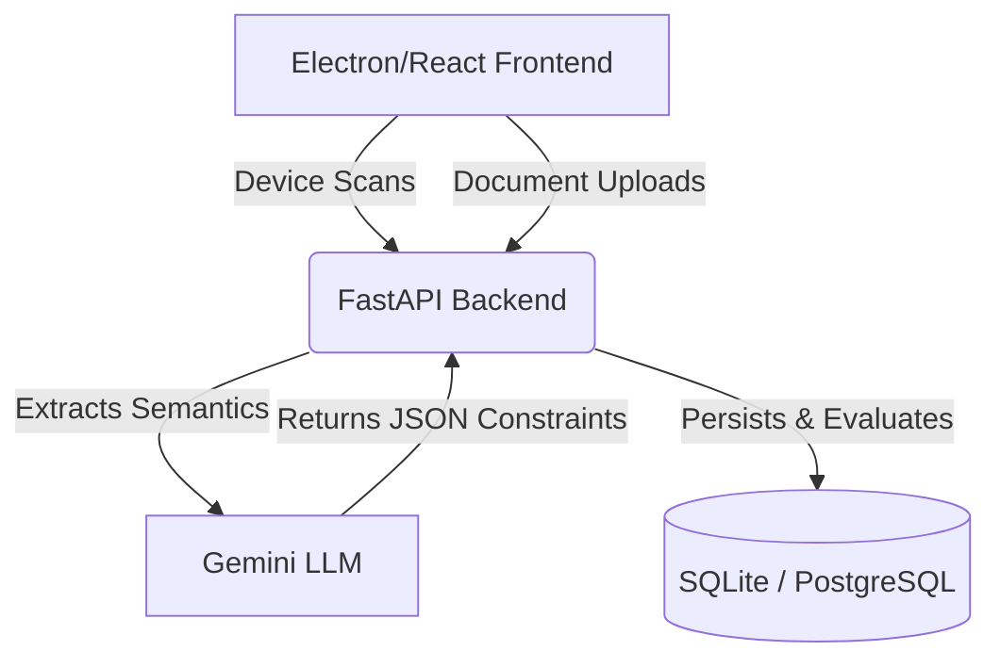

# Dynamic Compatibility Engine

## Project Overview

The Dynamic Compatibility Engine is an AI-driven platform that converts static enterprise configuration documentation (like PDFs and text bulletins) into a machine-readable knowledge graph for continuous endpoint compliance validation. 

**The Business Problem:** Enterprise IT teams manually parse complex compatibility matrices (e.g., "Software X version 2.0 requires Driver Y version > 1.5 but is incompatible with OS Patch Z"). This is tedious, error-prone, and scales poorly.

**High-Level System Workflow:** 
1. Administrators upload vendor release notes and compatibility matrices.
2. The backend uses a Generative AI LLM to extract definitive requirements and conflict rules.
3. Client machines are scanned natively via PowerShell to produce an accurate software/hardware inventory.
4. The system compares the live endpoint inventory against the dynamically extracted knowledge graph to flag violations, calculate a compliance score, and automatically construct customized remediation scripts.

---

## Key Features

* **Device inventory ingestion**: Gathers real local OS and hardware component data via native PowerShell scripts running inside Electron.
* **Compatibility validation**: Uses directed graphs to detect configuration conflicts and missing dependencies.
* **Rule-based compliance checking**: Calculates endpoint compliance scores based on centralized, structured database rules.
* **Knowledge-base driven validation**: Evaluates endpoints strictly against extracted rules rather than raw text.
* **AI-powered document ingestion**: Uses the Gemini API to intelligently extract structured constraints from unstructured PDFs and TXT files.
* **Compatibility rule extraction**: Identifies explicit `REQUIRES` and `INCOMPATIBLE_WITH` relationships from documents.
* **Administrative document management**: A secure UI to upload new compatibility documentation and delete legacy documentation.
* **Compatibility matrix generation**: A globally visible dashboard of all extracted rules.
* **Remediation recommendations**: Dynamically generates tailored, safe, and idempotent PowerShell remediation scripts using AI based on the specific root cause of detected violations.
* **IT Administrative Console**: Secure dashboard for database maintenance, document deletion, and system flushing.

---

## Architecture

The system utilizes a modern decoupled architecture:



* **Frontend:** A React Single Page Application wrapped in Electron. It acts as both the Administrative Console and the Endpoint Client.
* **FastAPI Backend:** Orchestrates document processing, graph analysis, and REST APIs.
* **Compatibility Knowledge Base:** The structured `rules` and `documents` tables holding extracted logic.
* **Database:** SQLite (default) or PostgreSQL.
* **Gemini Rule Extraction:** Google Generative AI is utilized strictly during document ingestion to translate human-readable enterprise manuals into structured graph relationships.

---

## Project Structure

* **`frontend/`**: The Electron desktop wrapper and React application code.
* **`backend/`**: The Python FastAPI application and utilities.
  * **`app/`**: Core backend source code.
    * **`api/v1/endpoints/`**: API routers grouping related endpoints (inventory, documents, chat, admin).
    * **`services/`**: Core business logic modules including `document_ingestion.py` (LLM processing) and `graph_service.py` (NetworkX validation logic).
    * **`models/`**: SQLAlchemy database ORM definitions mapping tables to Python classes.
    * **`schemas/`**: Pydantic schemas validating API inputs and shaping JSON outputs.
    * **`core/`**: Environment configuration and settings loading.
    * **`db/`**: SQLAlchemy engine and session generation logic.
  * **`seeds/`**: The root directory for data seeding.
    * **`compatibility_docs/`**: The physical target directory where uploaded PDF and TXT compatibility documents are persisted for the ingestion pipeline.
  * **`scripts/`**: Utility scripts, such as `flush_db.py` for administrative database truncation.

---

## Compatibility Knowledge Base

### Seed Document Ingestion

* **What `compatibility_docs` is:** A physical directory (`backend/seeds/compatibility_docs/`) storing the source-of-truth compatibility documents.
* **How documents are discovered:** On FastAPI startup, the system scans this directory for files that do not currently have a record in the `documents` database table.
* **How ingestion works:** For any un-ingested file, the system extracts its raw text (using `pdfplumber` for PDFs).
* **How Gemini extracts rules:** The raw text is passed to the Gemini LLM with a strict JSON-schema prompt asking it to identify hardware/software `REQUIRES` and `INCOMPATIBLE_WITH` relationships.
* **How rules are stored:** The JSON response is parsed and written permanently to the `rules` database table, maintaining a foreign key to the parent `documents` table record.

### Validation Flow

* **Documents are not queried during validation:** The system **never** reads physical PDFs or calls the LLM during endpoint validation. 
* **Validation uses rules stored in the database:** When a device submits an inventory scan, the backend queries the `rules` database table.
* **Compatibility checks are database-driven:** The `graph_service.py` engine loads these database rules into a NetworkX directed graph and evaluates the device's provided components against them, ensuring lightning-fast validation times.

---

## Environment Variables

These variables are defined in the `backend/.env` file and managed by `backend/app/core/config.py`.

```env
USE_SQLITE=true
POSTGRES_SERVER=localhost
POSTGRES_USER=postgres
POSTGRES_PASSWORD=postgres
POSTGRES_DB=compliance_engine
POSTGRES_PORT=5432
REDIS_URL=redis://localhost:6379/0
GEMINI_API_KEY=your_google_ai_key
SEED_DIR=path/to/seeds/compatibility_docs
ADMIN_MAINTENANCE_PASSWORD=admin123
```

* **`USE_SQLITE`**: Determines whether to use the local file-based `compliance.db` or connect to a Postgres instance.
* **`GEMINI_API_KEY`**: **Required.** The authentication key for Google Generative AI. Needed for document ingestion and dynamic remediation script generation.
* **`SEED_DIR`**: Automatically resolves to the `backend/seeds/compatibility_docs` directory.
* **`ADMIN_MAINTENANCE_PASSWORD`**: **Required.** Secures destructive IT Administrative operations like flushing the database or deleting documents. The frontend must send this password to execute these actions.

---

## Installation

### Backend Setup

Requires Python 3.10+.

```bash
cd backend
python -m venv venv

# On Windows:
.\venv\Scripts\activate
# On Mac/Linux:
source venv/bin/activate

# Install dependencies
pip install -r requirements.txt

# Start FastAPI server
python -m uvicorn app.main:app --port 8000
```

*Note: The backend natively creates its SQLite database schema on startup via `Base.metadata.create_all()`. No separate migration command is required for standard deployment.*

### Frontend Setup

Requires Node.js v18+.

```bash
cd frontend
npm install

# Start the React development server and Electron wrapper
npm run electron-dev
```

---

## Running the System

* **Backend Startup:** When `uvicorn` boots, it triggers `load_and_ingest_seeds()` which automatically ingests any new files discovered in the `SEED_DIR`.
* **Frontend Startup:** The Electron app executes a native `scan.ps1` PowerShell script on your local machine to collect an authentic OS, hardware, and software inventory.
* **Validation Check:** The frontend posts this inventory to the backend, which compares it against the previously extracted rules.

---

## Administrative Operations

### Document Upload
When an administrator uploads a new PDF/TXT file via the web console, the file is physically copied to the `compatibility_docs` directory. It is then immediately parsed via Gemini, its rules are extracted into the database, and the validation graph is updated in real-time.

### Document Removal
Protected by the `ADMIN_MAINTENANCE_PASSWORD`. Removing a document does three things:
1. Deletes all dynamically extracted compatibility rules associated with the document from the `rules` database table.
2. Deletes the document's tracking record from the `documents` database table.
3. Securely deletes the physical PDF/TXT file from the `SEED_DIR` to prevent it from being accidentally re-ingested on the next server reboot.

### Database Flush
Protected by the `ADMIN_MAINTENANCE_PASSWORD`. 
* **What gets deleted:** Truncates the `devices`, `device_components`, `documents`, and `rules` tables.
* **What remains:** Physical files in the `compatibility_docs` folder are completely untouched.
* **How re-ingestion works:** Because the database records are gone but the physical files remain, restarting the FastAPI backend will cause the startup routine to "discover" these files as if they were brand new, triggering a completely fresh Gemini LLM ingestion pipeline.

---

## Troubleshooting

### "No Rules Found" / Empty Compatibility Matrix
* **Empty database:** The system has not ingested any rules yet.
* **Missing Gemini API key:** Ingestion silently fails if the API key is missing or invalid. Check your `.env` file.
* **Failed ingestion:** The uploaded PDF may have been unreadable or contained no valid hardware/software correlations. Check the backend server logs for LLM parsing errors.
* **Incorrect seed directory:** Ensure `SEED_DIR` in `.env` is correctly targeting the physical folder containing your documents.

### Seed Documents Not Appearing
If documents are physically in the `compatibility_docs` folder but do not appear in the Knowledge Base Admin panel:
* Verify the backend server was restarted, as automatic discovery only runs on startup.
* Check if they were already ingested previously and removed manually from the database without being removed from the folder (though the Admin UI securely removes both).

### Validation Produces No Results
Ensure that the device scan actually contains components matching the exact names and versions specified in your enterprise compatibility documents. The compliance engine requires reasonably close naming conventions to trigger `REQUIRES` or `INCOMPATIBLE_WITH` flags.

### Database Flush Behavior
Be aware that executing the Database Flush operation drops all historical device scans and inventory records in addition to the compatibility rules.

---

## API Overview

* **Device/Validation APIs (`/api/v1/inventory`)**
  * `POST /`: Submit an endpoint inventory payload for compliance validation against the graph.
  * `GET /{device_id}`: Retrieve past scan results for a specific device.
  * `GET /rules`: Retrieve a flattened list of all active compatibility rules globally known to the system.
* **Document APIs (`/api/v1/documents`)**
  * `POST /ingest`: Upload a new compatibility PDF or TXT file.
  * `GET /`: List all tracked documents and their processing status.
  * `POST /{id}/remove`: Securely delete a document and its rules (requires Admin Password).
* **Administrative APIs (`/api/v1/admin`)**
  * `POST /flush`: Securely wipe all tracking databases (requires Admin Password).

---

## Development Notes

* **Data Isolation:** Compatibility rules are exclusively stored in the SQL database. Documents are *only* used during the one-time ingestion phase. Validation *never* reads directly from PDFs or queries the LLM.
* **LLM Usage:** Rule extraction is performed exactly once per document. The generated remediation scripts, however, dynamically invoke the Gemini LLM at runtime based on the specific root cause database fields of the detected violation.
* **Persistence:** Uploaded documents are permanently persisted into the local filesystem seed directory to allow the knowledge base to survive database wipes.
* **Cross-Platform:** The backend runs cleanly on Linux/Mac, but the Frontend Electron agent relies on Windows-native PowerShell commands (`Get-WmiObject`) to collect local inventory data.
