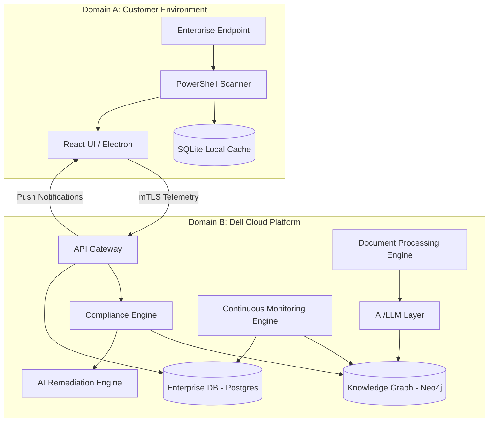
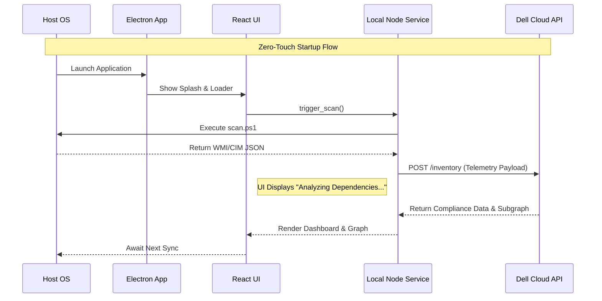
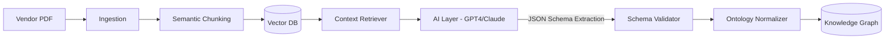
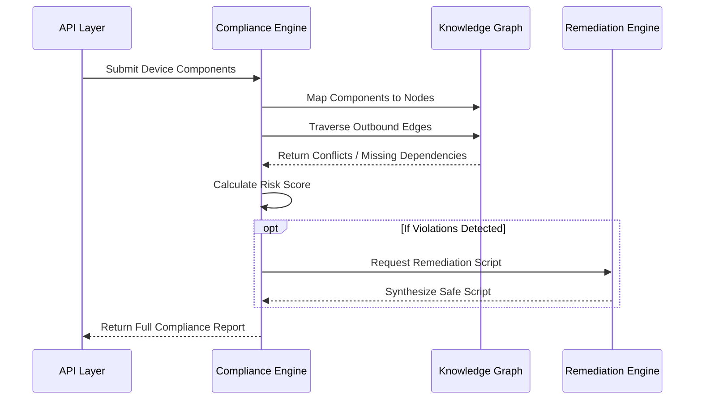
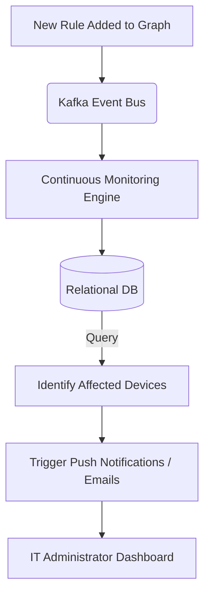

# CompactIQ Enterprise Architecture Vision

This document details the architectural evolution of the CompactIQ Enterprise Device Compatibility Intelligence Platform. Moving beyond the initial hackathon Minimum Viable Product (MVP), this document outlines the target state of the system—a highly scalable, AI-driven, continuous monitoring platform designed for global enterprise deployments at Dell. 

---

## 1. System Separation: The Dual-Domain Model

The enterprise architecture divides CompactIQ into two completely separate but continuously synchronized domains.

### 1.1 DOMAIN A: CUSTOMER SIDE (The Endpoint)
This domain resides on the enterprise customer's local network and individual endpoint devices. It acts as the telemetry gathering and immediate feedback layer.

#### Responsibilities
1. **Device Discovery:** Identifying the physical and virtual bounds of the device.
2. **Hardware Inventory Collection:** Querying WMI/CIM for deep hardware specifics.
3. **Software Inventory Collection:** Gathering installed applications, driver states, and service footprints.
4. **Local Cache:** Storing recent rule sub-graphs locally to allow limited offline validation and to reduce API chattiness.
5. **Dashboard Visualization:** Displaying compliance results to local administrators or users.
6. **Knowledge Graph Visualization:** Rendering the local subset of the global dependency graph.
7. **Compliance Display:** Presenting violations and overall scoring.
8. **Remediation Display:** Surfacing AI-generated fix actions.

#### Components
*   **Electron:** Provides a secure, sandboxed native desktop environment capable of interfacing with OS-level APIs.
*   **React:** Powers the UI, rendering dashboards and interactive graph visualizations (React Flow).
*   **PowerShell Scanner (`scan.ps1`):** A signed, native script executing low-level system queries (WMI/CIM, Registry) to extract configuration data.
*   **Node Backend Layer:** Handles IPC (Inter-Process Communication) and routes telemetry to the cloud.
*   **SQLite:** An embedded database for local caching of compliance rules, previous scans, and graph subsets.

#### Data Collected
*   **Operating System:** OS name, version, build number, patch level.
*   **BIOS / Firmware:** Manufacturer, version, release date.
*   **Drivers:** Network, storage, display, and chipset driver versions.
*   **Installed Software:** Enterprise applications, middleware, and specific versions.
*   **Security Agents:** CrowdStrike, Tanium, SentinelOne, Windows Defender states.
*   **Network Adapters:** Physical and virtual NIC configurations.
*   **Hardware:** CPU (Architecture, Cores), RAM, Storage (Type, Capacity, SMART status), GPU.

---

### 1.2 DOMAIN B: DELL CLOUD PLATFORM (The Brain)
This domain is hosted and managed within Dell's secure cloud infrastructure. It acts as the central intelligence hub, processing raw enterprise data into structured compatibility knowledge.

#### Responsibilities
1. **Rule Management:** Governing the lifecycle of compatibility rules.
2. **Document Processing:** Ingesting PDFs, text, and unstructured documentation from vendors.
3. **Knowledge Graph Management:** Maintaining the massive, interconnected map of all known hardware/software compatibilities.
4. **Compliance Validation:** Executing deep traversal algorithms to score devices.
5. **Monitoring:** Continuously tracking the health and compliance drift of fleets.
6. **Remediation Generation:** Utilizing GenAI to synthesize safe, executable remediation scripts.
7. **Analytics & Enterprise Reporting:** Providing fleet-wide compliance visibility to IT leadership.
8. **Version Intelligence:** Tracking End-of-Life (EOL) and End-of-Support (EOS) states.

---

## 2. Dell Cloud Architecture Detailed

The Dell Cloud Platform comprises several loosely coupled, highly scalable microservices.

### 2.1 API Layer
*   **Current MVP:** A monolithic FastAPI application handling all routes (`/inventory`, `/documents`, `/chat`).
*   **Future State:** An API Gateway routing to specialized FastAPI microservices (Inventory API, Graph API, Inference API).
*   **Responsibilities:** 
    *   **Device Registration:** Secure onboarding of new endpoints using mTLS.
    *   **Compliance Requests:** Receiving telemetry payloads and routing them to the validation engine.
    *   **Monitoring APIs:** Webhooks and WebSockets for real-time fleet updates.

### 2.2 AI Layer
*   **Purpose:** To convert unstructured enterprise compatibility documents into structured, machine-readable knowledge. AI is absolutely required because vendor documentation is highly varied, inconsistently formatted, and constantly changing—making regex or heuristic parsers brittle and unmaintainable at scale.
*   **Supported Models:** OpenAI GPT-4, Anthropic Claude 3.5 Sonnet, Google Gemini 1.5 Pro, and specialized Open Source Models (e.g., Llama 3) hosted securely within Dell's VPC for sensitive documents.
*   **Structured Output Expectation:** 
    *   *Input Example:* "Windows 11 24H2 requires BIOS >= 1.15 to avoid TPM polling failures."
    *   *Expected JSON Output:*
        ```json
        {
          "source_component": "Windows11",
          "target_component": "BIOS",
          "relationship": "REQUIRES",
          "condition": ">=1.15",
          "reasoning": "Avoid TPM polling failures."
        }
        ```

### 2.3 Document Processing Layer
*   **Components:** `PyMuPDF` (for vector PDFs), `pdfplumber` (for complex tables), and Tesseract OCR (for scanned documents).
*   **Pipeline:** 
    1.  **Ingestion & Chunking:** Splitting documents into semantic chunks (by paragraph or section).
    2.  **Vectorization:** Generating embeddings using an embedding model and storing them in a Vector DB (e.g., Pinecone or pgvector).
    3.  **Rule Extraction:** Feeding retrieved chunks to the AI Layer to extract specific `Rule` objects.
    4.  **Ontology Mapping:** Normalizing extracted entity names (e.g., "Win11", "Windows 11", "Win 11 24H2" all resolve to a canonical `Windows_11` node ID).

### 2.4 Knowledge Graph Layer
This is the major innovation of CompactIQ. Traditional tabular databases cannot efficiently traverse deep dependency chains (e.g., App A -> requires Framework B -> requires OS C -> conflicts with Driver D).
*   **Nodes:** Operating Systems, BIOS, Firmware, Drivers, Security Agents, Applications, Hardware, Policies.
*   **Edges:** `REQUIRES`, `DEPENDS_ON`, `SUPPORTED_ON`, `CONFLICTS_WITH`, `RECOMMENDED_WITH`, `UPGRADE_PATH`, `SECURITY_RISK`, `END_OF_SUPPORT`.
*   **Graph Construction:** Built continuously as the Document Processing Layer streams new rules. 
*   **Graph Updates:** Managed via event-driven architecture (Kafka) to immediately propagate new edges (e.g., a zero-day conflict).
*   **Dependency Resolution & Reasoning:** Utilizing graph algorithms (like Shortest Path, Subgraph Isomorphism) to traverse the tree. If Device A has Component X, the engine traverses all outgoing edges to ensure no required targets are missing and no conflicting targets are present.

### 2.5 Compliance Engine
*   **Current MVP:** An in-memory `NetworkX` graph built dynamically on every API request.
*   **Future State:** A distributed Enterprise Rule Engine backed by a dedicated Graph Database (e.g., Neo4j or Amazon Neptune).
*   **Validation Mechanics:** The engine accepts an endpoint's component list, projects those components as a subgraph against the master Knowledge Graph, and traverses relationships.
*   **Violation Detection & Scoring:** If a component hits a `CONFLICTS_WITH` edge targeting an installed component, a Critical violation is raised. If a `REQUIRES` edge points to a missing component, a High violation is raised. Scores degrade proportionally based on severity levels (Critical = -50, High = -30, Medium = -10).

### 2.6 Monitoring Engine (Net-New Component)
*   **Purpose:** Continuously monitor all registered devices against the evolving knowledge graph without requiring the device to re-scan.
*   **Capabilities:** 
    *   Periodic device scan orchestration (cron-based triggers).
    *   **Rule Update Notifications:** If Dell updates the graph with a new conflict, the engine instantly queries the database for all devices containing the affected components and triggers an alert.
    *   **Impact Assessments & Risk Predictions:** Forecasting which devices will become non-compliant if a fleet-wide OS upgrade is pushed.

### 2.7 Remediation Engine
*   **Current MVP:** Static, hardcoded string recommendations.
*   **Future State:** Generative AI-powered Remediation.
*   **Capabilities:** Synthesizing custom, context-aware PowerShell or Bash scripts to safely resolve violations. It performs Dependency Resolution (ensuring the fix doesn't break a different component) and provides Risk/Business Impact explanations to IT administrators before execution.

---

## 3. Application Flow Re-Architecture

**CRITICAL CHANGE:** The current MVP relies on manual intervention (User -> Clicks "Run Validation Check"). This is anti-pattern for an enterprise monitoring tool.

### 3.1 New Required Behavior
The application must execute silently and automatically, prioritizing time-to-value.
```text
Application Launch -> Auto Device Scan -> Loader Display -> Inventory Collection -> Send To Dell Cloud -> Compliance Validation -> Receive Results -> Display Dashboard
```

### 3.2 UI Flow State Machine
1.  **Splash Screen:** "CompactIQ Enterprise"
2.  **Enterprise-Grade Loader Sequence:**
    *   *Scanning Device...*
    *   *Collecting System Metadata...*
    *   *Analyzing Dependencies...*
    *   *Building Knowledge Graph...*
    *   *Running Compliance Checks...*
    *   *Generating Recommendations...*
3.  **Dashboard Render:** Only after completion does the UI render the Knowledge Graph, Violations, and Remediation panels. No manual button presses required.

---

## 4. System Flowcharts

### 4.1 High Level Architecture Diagram


### 4.2 Customer Device Flow


### 4.3 Knowledge Graph Construction & AI Rule Extraction Flow


### 4.4 Compliance Validation Flow


### 4.5 Continuous Monitoring Flow


---

## 5. Updated Database Design

To support enterprise scale, the data model transitions from simple SQLite tables to a distributed architecture involving PostgreSQL (for relational data) and Neo4j (for Graph Data).

### Relational Tables (PostgreSQL)
*   **`Tenant` / `EnterpriseCustomer`**: Manages logical isolation, billing, and global settings for different enterprises.
*   **`Device`**: Represents a physical/virtual endpoint. Indexed by MAC/UUID.
*   **`Component`**: Historical record of components tied to a device scan.
*   **`ScanHistory`**: Time-series table logging every scan event for audit trails.
*   **`Violation` / `Remediation`**: Caches specific violation instances and suggested fixes for reporting.
*   **`MonitoringEvent`**: Logs state changes (e.g., Device went from Compliant to Non-Compliant).
*   **`AIExtractionLog`**: Audits the LLM extraction pipeline (input chunk vs. output JSON) for quality assurance.

### Graph Nodes / Edges (Neo4j)
*   **`KnowledgeGraphNode`**: Represents canonical software/hardware. Indexed heavily on `Type` and `Version`.
*   **`KnowledgeGraphEdge`**: Represents relationships (`CONFLICTS_WITH`, `REQUIRES`). Contains metadata regarding the source document and AI confidence score.

### Scalability Considerations
*   Separating analytical graph queries (Neo4j) from transactional device updates (PostgreSQL) prevents database locking and ensures sub-second dashboard rendering even for fleets of 100,000+ devices.

---

## 6. Implementation Roadmap

*   **Phase 1: Current MVP** - Local scanning, heuristic rule extraction, in-memory NetworkX graph validation, manual execution.
*   **Phase 2: Cloud Connected** - Migrate backend to cloud APIs. Implement Zero-Touch automatic UI flow in the desktop app. Transition to PostgreSQL.
*   **Phase 3: AI Rule Extraction** - Replace heuristic parsing with an LLM-powered extraction pipeline using Retrieval-Augmented Generation (RAG).
*   **Phase 4: Enterprise Graph DB** - Replace NetworkX with Neo4j. Implement strict Ontology Mapping for canonical device naming.
*   **Phase 5: Continuous Monitoring** - Implement the background monitoring engine, Kafka event bus, and proactive push notifications.
*   **Phase 6: Enterprise Scale Multi-Tenant Deployment** - RBAC, SAML/SSO integration, Tenant isolation, and global predictive compatibility intelligence.

---

## 7. Current Code Mapping & Migration Strategy

| File / Component | Current Role (MVP) | Future Role (Enterprise) | Required Changes & Migration Strategy | Tech Debt & Priority |
| :--- | :--- | :--- | :--- | :--- |
| `frontend/src/hooks/useDeviceScan.js` | Manual scan trigger via button. Displays simple compliance. | Zero-Touch automated dashboard. | **HIGH PRIORITY:** Remove manual button. Implement `useEffect` auto-trigger and enterprise loading sequence. | High Debt (Manual Flow) |
| `frontend/public/scan.ps1` | Basic WMI/CIM polling. | Deep forensic scanner. | Add support for reading application specific config files and deeper registry inspection. | Medium Debt |
| `backend/app/services/document_ingestion.py` | Heuristic string matching for rule extraction. | RAG/LLM Extraction Pipeline orchestrator. | **HIGH PRIORITY:** Replace heuristics with LangChain/LlamaIndex calls to an LLM for structured JSON output. | High Debt (Brittle Regex) |
| `backend/app/services/graph_service.py` | In-memory NetworkX graph processing. | Interface layer to dedicated Graph DB (Neo4j). | Deprecate NetworkX for production. Rewrite traversal logic in Cypher query language. | Medium Debt (Scalability) |
| `backend/app/api/v1/endpoints/inventory.py` | Receives scan, builds graph in-memory, scores device. | Receives scan, queries Neo4j, triggers AI Remediation. | Decouple graph building from the validation request path to improve latency. | High Debt (Synchronous Processing) |
| `backend/app/models/models.py` | Simple SQLite models. | PostgreSQL + Multi-tenant schema. | Add `TenantID`, `ScanHistory`, `AIExtractionLog` tables. Migrate to Alembic migrations. | Medium Debt |
| `backend/app/api/v1/endpoints/chat.py` | Mocked static string response. | Conversational AI Interface to Knowledge Graph. | Connect to LLM agent equipped with Graph Query tools (Text2Cypher). | Low Priority (Feature Enhancement) |
