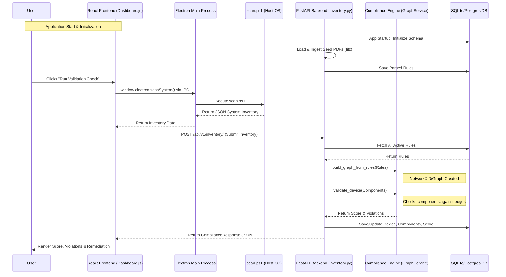

# CompactIQ - Codebase Working Details

This document explains the inner workings of the CompactIQ application, detailing what each code file does, the technologies used for data extraction, the compliance checking methodology, and a flowchart illustrating the application's execution path.

## 1. What Each Code File is Doing

### Backend (`/backend/app`)

*   **`main.py`**: The main entry point for the FastAPI backend. It initializes the application, configures CORS, triggers the database schema creation on startup, automatically loads seed documents into the system, and mounts the API routers under `/api/v1`.
*   **`api/v1/api.py`**: The central router aggregator. It bundles the individual endpoint routers (`inventory`, `documents`, `chat`) into a single API router.
*   **`api/v1/endpoints/chat.py`** ⚠️ **[MOCK DATA]**: Exposes the `/chat` endpoint. Currently, this returns a mocked, hardcoded AI response explaining why an endpoint is non-compliant rather than calling a real LLM.
*   **`api/v1/endpoints/documents.py`**: Exposes the `/documents/ingest` and `/documents/` endpoints. It handles the uploading of compatibility documents (saving them to the seed directory) and triggers the ingestion and rule extraction pipeline.
*   **`api/v1/endpoints/inventory.py`** ⚙️ **[REAL CALCULATION] & ⚠️ [MOCK DATA]**: The core endpoint for device compliance. 
    *   `POST /inventory/`: Receives scanned device inventory, triggers the real compliance validation engine (`graph_service.py`), updates the database, and returns violations. *Note: The remediation steps returned are currently mocked data.*
    *   `GET /inventory/{device_id}`: Retrieves previous scan results and compliance state from the database.
    *   `GET /inventory/graph/elements`: ⚙️ **[REAL CALCULATION]**: Uses the `graph_service` to dynamically calculate graph node positions and dependency chains for the frontend.
*   **`core/config.py`**: Manages environment variables and application settings (like database URLs and seed paths).
*   **`db/database.py`**: Sets up the asynchronous SQLAlchemy database engine and session maker.
*   **`models/models.py`**: Defines the SQLAlchemy ORM models representing the database schema: `Device`, `DeviceComponent`, `Document`, and `Rule`.
*   **`schemas/schemas.py`**: Defines the Pydantic data schemas used to validate incoming API requests and format outgoing JSON responses.
*   **`services/document_ingestion.py`** ⚠️ **[MOCK DATA]**: Responsible for processing uploaded documents. While it extracts raw text genuinely using `PyMuPDF`, the `extract_rules_from_text` function relies on mocked, hardcoded list appends to generate dependency rules, simulating what a real LLM would extract.
*   **`services/graph_service.py`** ⚙️ **[REAL CALCULATION]**: Contains the core logic of the **Compliance Engine**. It uses the `networkx` library to build a real Directed Graph out of the extracted rules and dynamically calculates compliance (`validate_device()`), deducting points and returning mathematically accurate violation chains.

### Frontend (`/frontend`)

*   **`public/electron.js`** & **`public/preload.js`**: Handle native OS window creation, desktop security contexts, and expose an IPC bridge so React can securely run native commands.
*   **`public/scan.ps1`** ⚙️ **[REAL DATA/CALCULATION]**: A native PowerShell script that executes real, low-level WMI/CIM queries on the host OS to extract genuine hardware and software inventory data.
*   **`src/api.js`**: An Axios-based HTTP client containing all helper functions for React to communicate with the FastAPI backend.
*   **`src/App.js`**: The main React component handling the sidebar layout and `react-router-dom` navigation routing.
*   **`src/index.js`**: The standard React entry point that mounts the application to the HTML DOM.
*   **`src/index.css`**: Contains global CSS variables, custom themes, layout utility classes, and keyframe animations.
*   **`src/context/AppContext.js`**: React Context provider managing global application state, including graph node datasets and UI modal toggles.
*   **`src/components/ComponentModal.js`** ⚙️ **[REAL CALCULATION]**: Renders the detailed view of a selected graph node, dynamically parsing the NetworkX backend output to accurately calculate and display its explicit upstream and downstream dependency chains.
*   **`src/pages/Dashboard.js`**: The primary end-user interface. Features the validation check button, triggering the real local `scan.ps1` and visualizing the resulting compliance score, system inventory, and violations.
*   **`src/pages/DocumentUpload.js`** ⚠️ **[MOCK DATA]**: UI for uploading PDFs. Contains a simulated, hardcoded animated terminal sequence designed to fake the process of LLM semantic extraction.
*   **`src/pages/GraphView.js`**: The primary IT Admin view rendering the interactive **Compatibility Knowledge Graph** using `react-flow-renderer`, visualizing deep transitive dependencies and conflicts based on coordinates calculated by the backend.
*   **`src/pages/ComponentExplorer.js`**: An IT Admin UI rendering a searchable, tabular list of all recognized components in the system.
*   **`src/pages/RulesMatrix.js`**: An IT Admin UI displaying the active compliance and conflict rules ingested into the database.
*   **`src/pages/LandingPage.js`**: The initial splash screen allowing the user to select between the "IT Administrative Console" and the "Client Device Portal".

---

## 2. Mock Data vs. Real Logic Boundary

It is important to understand where the system fakes functionality for demonstration (MVP) versus where it performs genuine computational logic.

### Where Mock Data is Used ⚠️
*   **Rule Extraction (`services/document_ingestion.py`)**: Instead of a real LLM reading the PDFs and dynamically outputting relationships, the system relies on hardcoded rules appended to a list to simulate the extraction process.
*   **AI Explanations (`api/v1/endpoints/chat.py`)**: The chat assistant returns a static, hardcoded string.
*   **Remediation Scripts (`api/v1/endpoints/inventory.py`)**: The auto-remediation bash/PowerShell scripts returned to the user are static strings, not dynamically synthesized fixes.

### Where Real Calculation is Done ⚙️
*   **Device Scanning (`public/scan.ps1`)**: The inventory retrieved from the Windows machine is 100% real.
*   **Compliance Validation (`services/graph_service.py`)**: The engine genuinely processes the inventory against the rules. If a rule demands BIOS > 1.15 and the real scan shows BIOS 1.10, the engine performs a real mathematical calculation to flag the violation and dock points.
*   **Topological Graphing (`services/graph_service.py`)**: The `networkx` algorithms calculate genuine transitive dependency paths and generation depths, which are accurately rendered by the React frontend.

---

## 3. Compliance Engine Architecture

**Yes, there is a separate, deterministic compliance engine.** The compliance evaluation is **not** offloaded to an LLM.

The compliance engine is built using a mathematical graph approach (located in `backend/app/services/graph_service.py`):
1.  **Graph Construction**: The `GraphService` class uses the `networkx` library to build a Directed Graph (DiGraph). The nodes are software/hardware components, and the edges are the relationships defined by the rules (e.g., `REQUIRES`, `INCOMPATIBLE`).
2.  **Validation Check**: When a device submits its inventory, the engine's `validate_device()` method loops through the device's components and compares them against the edges in the graph.
3.  **Scoring & Violations**: If a component has an `INCOMPATIBLE` edge with another installed component, or lacks a target defined by a `REQUIRES` edge, the engine deterministically subtracts points from a base score of 100 and generates a detailed `Violation` report.

---

## 4. Application Flowchart

Below is a Mermaid flowchart depicting how the application components interact, starting from user interaction down to the database and back.

