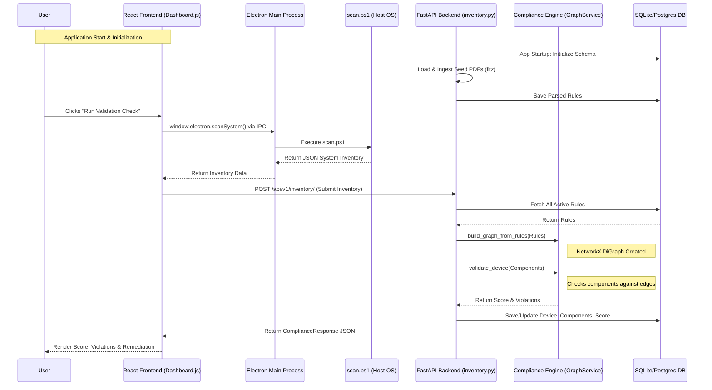

# CompactIQ - Codebase Working Details

This document explains the inner workings of the CompactIQ application, detailing what each code file does, the technologies used for data extraction, the compliance checking methodology, and a flowchart illustrating the application's execution path.

## 1. What Each Code File is Doing

### Backend (`/backend/app`)

*   **`main.py`**: The main entry point for the FastAPI backend. It initializes the application, configures CORS, triggers the database schema creation on startup, automatically loads seed documents into the system, and mounts the API routers under `/api/v1`.
*   **`api/v1/api.py`**: The central router aggregator. It bundles the individual endpoint routers (`inventory`, `documents`, `chat`) into a single API router.
*   **`api/v1/endpoints/chat.py`**: Exposes the `/chat` endpoint. Currently, this returns a mocked, hardcoded AI response explaining why an endpoint is non-compliant.
*   **`api/v1/endpoints/documents.py`**: Exposes the `/documents/ingest` and `/documents/` endpoints. It handles the uploading of compatibility documents (saving them to the seed directory) and triggers the ingestion and rule extraction pipeline.
*   **`api/v1/endpoints/inventory.py`**: The core endpoint for device compliance. Contains:
    *   `POST /inventory/`: Receives scanned device inventory, rebuilds the active rule graph, runs the compliance validation engine, updates the database, and returns violations and remediation steps.
    *   `GET /inventory/{device_id}`: Retrieves previous scan results and compliance state from the database.
    *   `GET /inventory/graph/elements`: Generates node and edge JSON data required by the frontend's React Flow visualization to map out device dependencies.
*   **`core/config.py`**: Manages environment variables and application settings using `pydantic_settings`. It handles paths to seed documents and configures the database connection (SQLite or PostgreSQL).
*   **`db/database.py`**: Sets up the asynchronous SQLAlchemy database engine and provides a dependency injection function (`get_db`) to yield database sessions.
*   **`models/models.py`**: Defines the SQLAlchemy ORM models representing the database schema: `Device`, `DeviceComponent`, `Document`, and `Rule`.
*   **`schemas/schemas.py`**: Defines the Pydantic data schemas used to validate incoming API requests and format outgoing JSON responses (e.g., `InventoryRequest`, `ComplianceResponse`).
*   **`services/document_ingestion.py`**: Responsible for processing uploaded compatibility documents (PDFs/TXTs). It uses PyMuPDF (`fitz`) to extract raw text and contains a heuristic parser that simulates an LLM to extract dependency rules (like "REQUIRES" or "INCOMPATIBLE_WITH") from the text.
*   **`services/graph_service.py`**: Contains the core logic of the **Compliance Engine**. It uses the `networkx` library to build a Directed Graph out of the extracted rules and provides the `validate_device()` method to check a device's components against the graph, deducting points for violations.

### Frontend (`/frontend`)

*   **`public/electron.js`**: The main process file for the Electron desktop application. It creates the native OS window, configures security settings, and exposes an IPC (Inter-Process Communication) handler (`scan-system`) to run PowerShell scripts on the host machine.
*   **`public/preload.js`**: The bridge script between Electron's Node.js environment and the React web app. It securely exposes the `scanSystem` function to the browser window.
*   **`public/scan.ps1`**: A native PowerShell script executed by the Electron app. It uses WMI/CIM queries to extract real hardware and software inventory from the Windows machine (OS version, BIOS, Network Adapters, Security Software, etc.) and formats it as JSON.
*   **`src/api.js`**: An Axios-based HTTP client that contains all the helper functions for the React frontend to communicate with the FastAPI backend.
*   **`src/App.js`**: The main React component that handles the application layout (the sidebar navigation) and utilizes `react-router-dom` to route users between the Dashboard and the Graph View.
*   **`src/index.js`**: The standard React entry point that mounts the `App` component to the HTML DOM.
*   **`src/pages/Dashboard.js`**: The primary user interface. It features the "Run Validation Check" button, which either triggers the local PowerShell scan (if running in Electron) or fetches the latest scan from the backend. It visualizes the resulting compliance score, system inventory, violations, and suggested remediations.
*   **`src/pages/GraphView.js`**: Renders an interactive visualization of the compliance rules and device dependencies using the `react-flow-renderer` library.

---

## 2. LLMs Used for PDF Conversion

Currently, **no LLMs are being used** for the PDF conversion or the rule extraction pipeline. 

The application implements a "mocked" LLM pipeline designed as a hackathon Minimum Viable Product (MVP):
1.  **Text Extraction**: It uses a standard Python library called `PyMuPDF` (`fitz`) to extract the raw string text from PDF files.
2.  **Rule Extraction**: Inside `backend/app/services/document_ingestion.py`, the function `extract_rules_from_text` simulates an LLM's structured output. It uses simple string/regex heuristics (e.g., checking if `"BIOS versions < 1.15.0"` is in the text) to generate hardcoded `Rule` objects.

---

## 3. Compliance Engine Architecture

**Yes, there is a separate, deterministic compliance engine.** The compliance evaluation is **not** offloaded to an LLM.

The compliance engine is built using a mathematical graph approach (located in `backend/app/services/graph_service.py`):
1.  **Graph Construction**: The `GraphService` class uses the `networkx` library to build a Directed Graph (DiGraph). The nodes are software/hardware components, and the edges are the relationships defined by the rules (e.g., `REQUIRES`, `INCOMPATIBLE`).
2.  **Validation Check**: When a device submits its inventory, the engine's `validate_device()` method loops through the device's components and compares them against the edges in the graph.
3.  **Scoring & Violations**: If a component has an `INCOMPATIBLE` edge with another installed component, or lacks a target defined by a `REQUIRES` edge, the engine deterministically subtracts points from a base score of 100 and generates a detailed `Violation` report.

---

## 4. Application Flowchart

Below is a Mermaid flowchart depicting how the application components interact, starting from user interaction down to the database and back.

